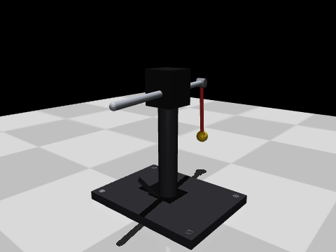
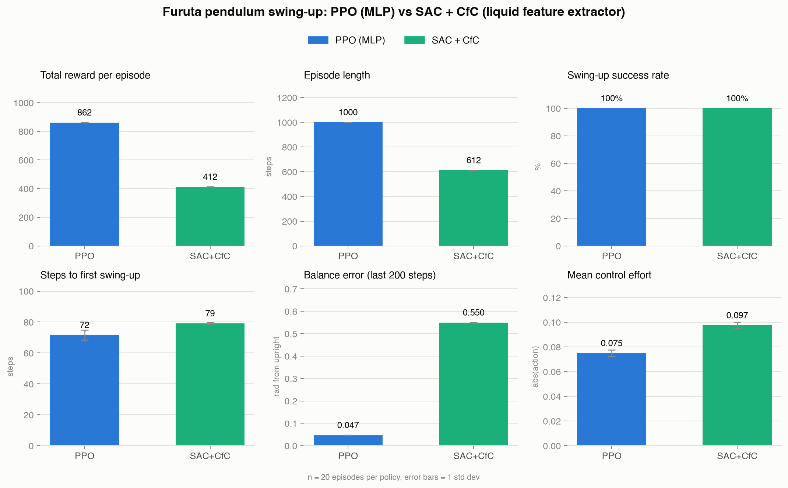
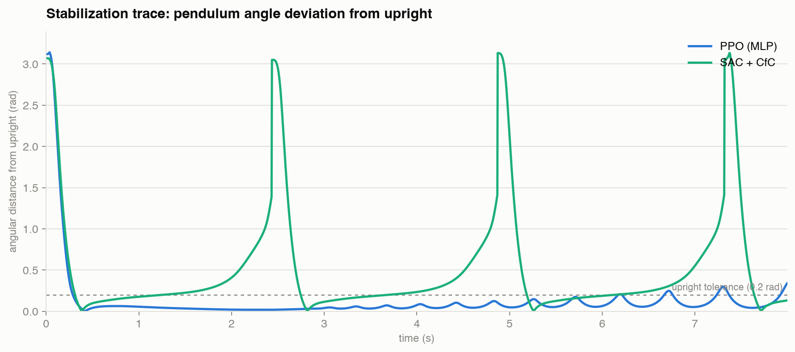

## SAC + Liquid Neural Network on Furuta Pendulum

Furuta Pendulum is the classical control/RL problem and I would regard this as something similar to "Italian Opening" in Chess since learning and playing around with this can provide a lot of learning benefits. I have come across Liquid Neural Networks from one of the burmese NLP AI researchers and I am curious to know how it fares in RL/robotics applications. Therefore, I have developed a small-scale project to test the LNN+SAC policy in Furuta control and benmark its performance against well-proven PPO policy. For the simulation, I have developed a simple pendulum xml for easier prototyping.  

|                                       PPO (MLP)                                       |                                    LNN + SAC                                  |
| :-------------------------------------------------------------------------------------: | :--------------------------------------------------------------------------------: |
|                               |                  |

### Results

20 evaluation episodes per policy, deterministic actions, identical seeds:

| Metric                          |   PPO (MLP) | SAC + CfC |
| -------------------------------- | ----------: | --------: |
| Total reward / episode          |     **862** |       412 |
| Episode length (steps)          |    **1000** |       612 |
| Swing-up success rate           |        100% |      100% |
| Steps to first swing-up         |      **72** |        79 |
| Balance error, last 200 steps   | **0.047 rad** | 0.550 rad |
| Mean control effort             |   **0.075** |     0.097 |

For now, the LNN+SAC policy is very weak. If we apply this for time-series or coninousuous applications where LNNs are strong, we might be able to see interesting results.
